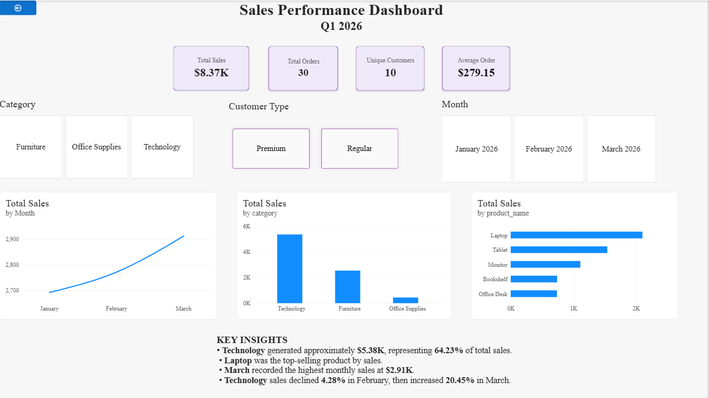
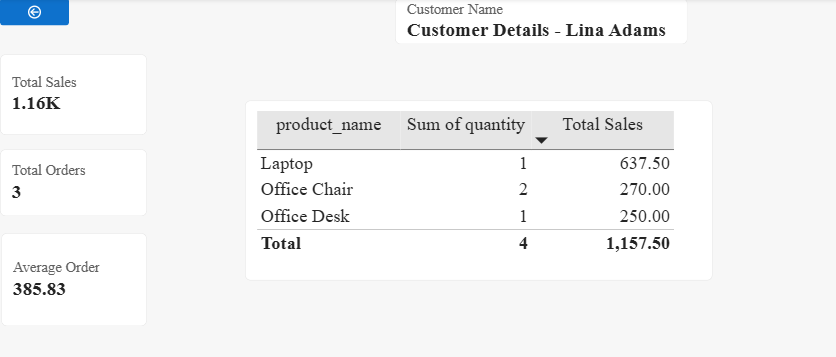
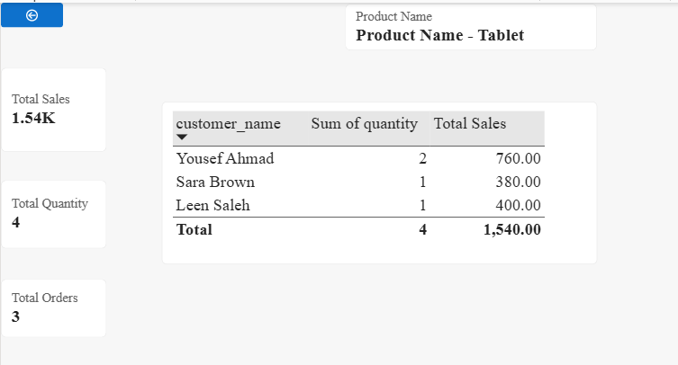

# Sales Performance Analysis — Q1 2026

## 📊 Project Overview

This project analyzes sales performance during Q1 2026 using Power BI.

The dashboard provides insights into sales trends, product performance,
customer behavior, category performance, and progress toward a sales target.

## 🎯 Business Objective

The objective of this project was to transform relational sales data into
an interactive dashboard that helps identify:

- Understanding overall sales performance
- Identifying the best-performing product categories
- Identifying top products and customers
- Analyzing monthly sales trends
- Comparing customer types
- Measuring month-over-month (MoM) growth
- Tracking performance against a sales target
- Providing interactive customer and product-level analysis

## 🛠️ Tools & Technologies

- **PostgreSQL** — Data storage and SQL analysis
- **SQL** — Data querying and analysis
- **Power Query** — Data transformation and preparation
- **Power BI** — Data modeling and visualization
- **DAX** — Measures, KPIs, and time-intelligence calculations

## 🗂️ Data Model

The project uses a relational data model consisting of:

- **Customers** — customer information and customer type
- **Products** — product information, categories, and prices
- **Orders** — order dates, quantities, and discounts
- **DateTable** — date dimension used for time-based analysis

Relationships were created between customers, products, orders, and the
date dimension to support accurate analysis.

## 📈 Key KPIs

| KPI | Result |
|-----|-------:|
| Total Sales | $8.37K |
| Total Orders | 30 |
| Unique Customers | 10 |
| Average Order Value | $279.15 |
| Target Achievement | 83.75% |

## 🔍 Key Insights

- Technology was the highest-performing category, generating approximately
  $5.38K and contributing 64.23% of total sales.
- Laptop was the top-selling product by sales.
- March recorded the highest monthly sales at approximately $2.91K.
- Technology sales declined by 4.28% in February, then increased by 20.45%
  in March.

## 📊 Dashboard Features

- KPI cards
- Monthly sales trend
- Sales by category
- Top 5 products
- Category filtering
- Customer type filtering
- Month filtering
- Customer drill-through
- Product drill-through
- DAX-based sales and performance metrics

## 🧮 DAX Analysis

The project includes measures for:

- Total Sales
- Total Orders
- Total Quantity
- Average Order Value
- Unique Customers
- Technology Sales
- Technology Sales %
- Previous Month Sales
- MoM Growth %
- YTD Sales
- Target Achievement %
- Top N analysis

## 🗄️ SQL Analysis

The underlying data was stored and analyzed in PostgreSQL.

SQL techniques used include:

- SELECT
- WHERE
- JOIN
- GROUP BY
- HAVING
- Aggregate functions
- CASE WHEN
- Calculated values
- Customer analysis
- Product analysis
- Category analysis
- Monthly sales analysis
- ORDER BY
- LIMIT

## 📷 Dashboard

### 1. Sales Performance Dashboard

### 2. Customer Details

### 3. Product Details

## 💡 What I Learned

Through this project, I practiced an end-to-end data analysis workflow, including:

- Working with relational databases
- Writing SQL queries
- Connecting PostgreSQL to Power BI
- Data cleaning and transformation with Power Query
- Building relationships and a date table
- Creating DAX measures
- Applying filter context and time intelligence
- Creating interactive dashboards
- Using drill-through analysis
- Translating data into business insights
